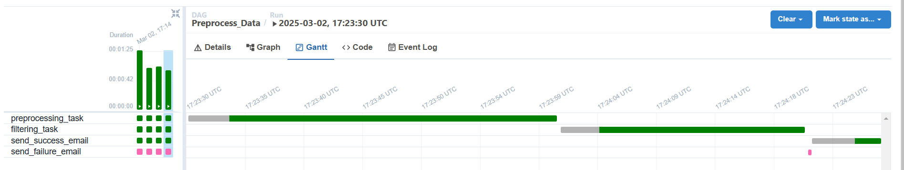
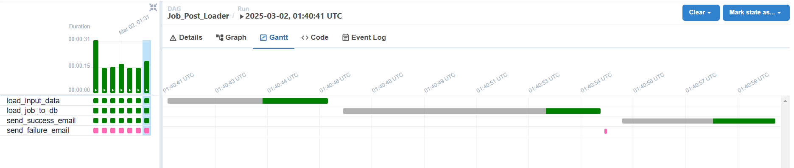
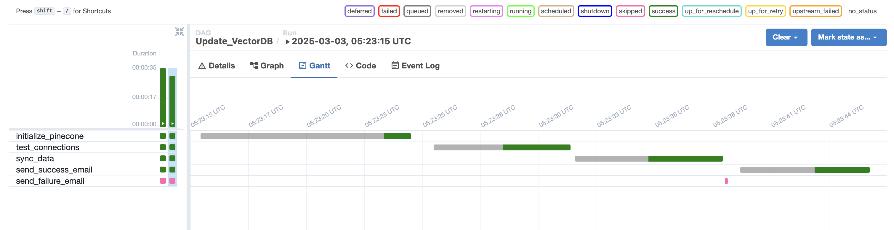
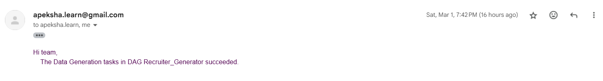

# LinkedLens

## Desciption

This project aims to aid job seekers and recruiters in job searching. The project would integrate a conversational chatbot with Retrieval Augmented Generation (RAG) to allow users to enter natural language queries that retrieve and summarize related information from company job listings, recruiter posts, and other relevant user posts. Continuous data integration and tracking Time-To-Live would ensure that users would receive the latest insights and job openings. By creating a chatbot that implements these features, the goal of this project is to enhance and streamline existing job search portals and professional social media platforms.

1. Data Preprocessing Pipeline
2. Data Generation Pipeline
3. Model Development Pipeline
4. CI/CD - Workflow Automation
5. Testing

## Data Preprocessing and Generation Pipeline

### Overview 
We process a [Kaggle dataset](https://www.kaggle.com/datasets/arshkon/linkedin-job-postings) containing job postings, preprocess the data, and store it in a GCP bucket. Using this preprocessed data, we generate synthetic user profiles, recruiter job posts, and interview experience posts using LLM APIs. The generated data is validated using Pydantic before loading it into Firestore DB.

To get an overview of our data exploratory analysis and data bias, refer [link](data-pipeline/)

### 1. Data Preprocessing Pipeline

- Handling Missing Values: Rows are removed if any of the mandatory columns (`description`, `title`, `company_name`, `company_id`, `job_id`) contain NaN values.
- Basic Text Cleaning: Remove leading and trailing whitespaces.
- Removing Duplicates
- Filter for Tech Industry
- Stores the cleaned and filtered dataset in a GCP bucket for downstream processing.

#### DAG Overview
| DAG Name                            | Description                                                                                             |
| ----------------------------------- | --------------------------------------------------------------------------------------------------- |
| **Preprocess_Data**              | Reads raw data from GCS, performs data cleaning (handling missing values, stripping text, removing duplicates, and filtering for the tech industry), and writes the cleaned data back to GCS.  |


#### DAG Execution Flow




### 2. Data Generation and Loading Pipeline

#### DAGS Overview
| DAG Name                     | Description                                                                                     |
| ---------------------------- | ----------------------------------------------------------------------------------------------- |
| **Recruiter_Generator**      | Generates recruiter profiles using LLMs and validates them with Pydantic. `User` and `UserList` |
| **Recruiter_Post_Generator** | Creates recruiter job posts using the preprocessed job dataset as input. `Post`                 |
| **User_Post_Generator**      | Generates interview experience posts based on job postings (company name and title).  `Post`    |
| **Job_Post_Loader**          | Loads validated job data into Firestore DB. `JobPosting`                                        |


#### DAG Execution Flow

- Recruiter_generator


The duration of the `user_recruiter_generation` step varies based on the number of users being created.

- Recruiter_Post_Generator:


The duration of the `create_hiring_posts` step varies based on the number of users being created.

- User_Post_Generator


The duration of the `create_user_posts` step varies based on the number of users being created.

- Job_Post_Loader




### 3. Data Loading Pipeline

#### DAGs Overview
| DAG Name                     | Description                                                                                     |
| ---------------------------- | ----------------------------------------------------------------------------------------------- |
| **Update_VectorDB**      |Initializes Pinecone (vector store), tests connectivity to Firestore and Vector DB, and ingests/syncs data to vector store   |
 
#### DAG Execution Flow




#### Logging and Tracking
- Logs are generated at each step and for all functions.
- The logs are currently collected using the in-built Airflow logger
- Errors are captured and logged for easy debugging and resolution.
- Any errors during the pipeline runs result in a failed run, and appropriate notifications are sent to alert about the status.

#### Notification

All DAGs send an email notification updating the status. The email notifications are sent for both failed/successful runs of the data pipelines. An example of the email notification is attached below.




#### LLM and API Used
We utilize the OpenRouter API via the LangChain OpenAI package to generate text-based content. The responses are validated using Pydantic to maintain structure and consistency.

- Model used: LLaMA- **meta-llama/llama-3.3-70b-instruct:free**

OpenRouter Models: https://openrouter.ai/models

### GCP Setup (For Data Preprocessing and Generation)


#### One-Time Setup

- Create a GCP Project - Name: LinkedLens

- Create Service Accounts with roles:

    - **Data Processing**: `Cloud Datastore User`, `Storage Object User`. Create and save key `json`

    - **Infrastructure Management**: `Editor` (to create Firestore DB, VM, and bucket)

- Create Firestore DB

    - Create VM Instance
    
    - Create VM Instance

    - Debian-based VM

    - 20GB persistent memory

    - Allow HTTP & HTTPS

    - Enable IP forwarding

    - Add firewall rules to allow:
  ```
        - **allow-ssh** (Ingress) → `tcp:22`  
        - **airflow-port** (Ingress) → `tcp:8080`  
        - **airflow-port** (Ingress) → `tcp:8080` and `tcp:9090`  
        - **allow-dns** (Egress) → `tcp:53, udp:53`  
        - **smtp-outbound-vm** (Egress) → `tcp:587`
  ```

    - Ensure network tags are assigned to the VM.

    - Install Docker on VM: Follow Docker installation guide: [Docker Docs](https://docs.docker.com/engine/install/debian/)

- Create GCS Bucket:
    - Bucket Name: `linkedlens_data`
    - Purpose: Stored raw and preprocessed data.
      
- Create Cloud Run Function
    - Cloud Run is used to trigger DAG runs on the Compute Engine.
    - Follow the [steps](gcp-deploy/functions/dag-trigger/README.md) to set up and run functions

### Workflow Automation


- There are three GitHub Action workflows currently set up:
    - `update_code_vm.yml`: Ensure git repo changes are synced to VM
    - `trigger_airflow_generation.yml`: Restarts the airflow container for the data generation pipeline
    - `trigger_airflow_data_pipeline.yml`: Restarts the airflow container for the data pipeline
- The `update_code_vm.yml` workflow is triggered when there are changes to the respective pipeline folders (`data-generation/**` and `data-pipeline/**`) on the main branch or when using manual dispatch.
- The remaining two workflows are triggered on completion of workflow runs of `update_code_vm.yml`. There are additional checks to ensure that the containers are only restarted when required.
  
### Folder Structure


- The data preprocessing pipeline and data generation pipeline follow a similar structure as follows:
    - data-generation/
        - dags/ - Contains DAG Definitions for data preprocessing and generation
            - src/
                - config/ (`config.py` Manages environment variables)
                - credentials/ (`linkedlens-firestore-srvc-acc.json` GCP credentials for authentication)
                - experiments/ (`test.ipynb` - Testing LLM prompts)
                - llm/
                - schema/ (Contains all Pydantic validation schemas)
                - utils/ (Helper functions for data processing) 
            - job_data_generation.py
            - recruiter_generation.py
            - recruiter_post_generation.py
            - user_post_generation.py
        - .env_template

- All Pydantic validation classes are stored in the schema/ directory. These classes ensure data integrity before inserting records into Firestore DB.

    Validation ensures:

    - Correct data types.

    - Required fields are present.

    - Structured output for LLM-generated content.

- The gcp-deploy folder contains code for any Cloud Run functions or services.

#### Testing

##### Data Preprocessing & Validation
1. Type Conversion & Cleaning: Ensuring numeric/string company IDs are standardized, NaN handling, and dtype consistency.
2. Schema Enforcement: Validation of JobPosting Pydantic models with edge cases like epoch timestamp handling.
3. Data Integrity: Testing dataframe operations (merges, drops, enrichment) in enrich_and_clean_postings to ensure valid titles, locations, and company mappings.
4. Company-User Mapping: Verifying correct user allocation ratios with create_company_user_map.
5. ID Generation Workflows: Testing UUID generation, rate limiting, and uniqueness checks for user/post creation.
6. External Service Simulation: Mocking LLM chains (e.g., DummyPostChain, DummyUserChain) to validate structured JSON outputs without real API calls.
7. Rate Limiter Behavior: Simulating allowed/blocked states to test conditional logic in data generation pipelines.
8. Deterministic UUIDs: Using patched UUIDs to verify ID assignment and relational integrity between users and posts.
9. Empty/missing data, invalid types, and schema violations (e.g., testing ValidationError for malformed job postings).
10. Stress-testing functions with mixed data types, zero values, and unexpected NaN propagation.

Test suite combines pandas-based assertions, Pydantic model validation, and unittest.mock to isolate components, ensuring reliability across data pipelines, model hydration, and synthetic data generation workflows.

The results of a test run for all the files in data-generation/dags/src/


