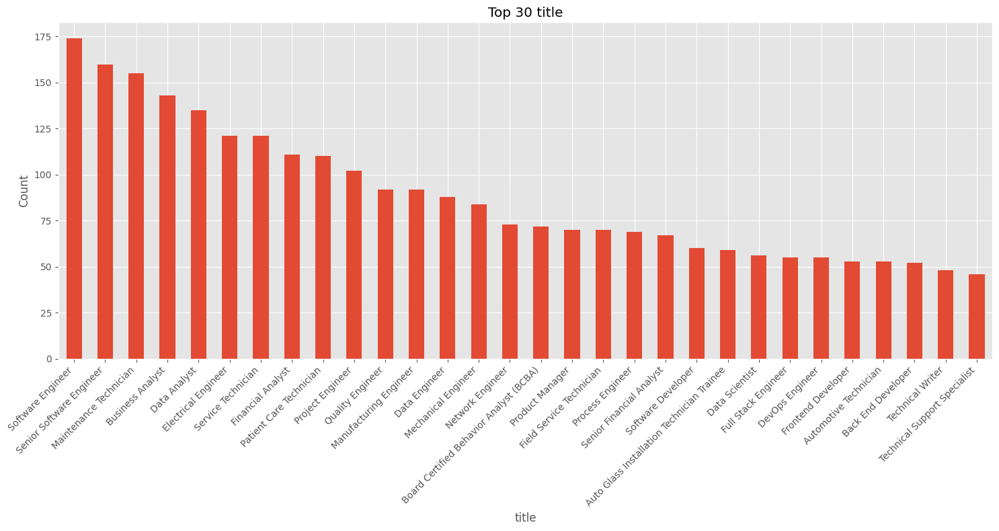
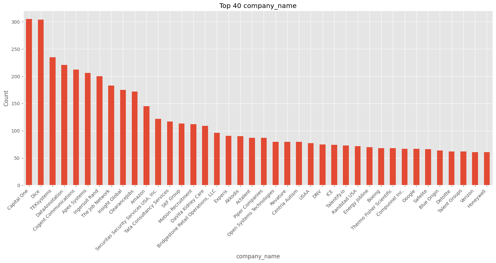
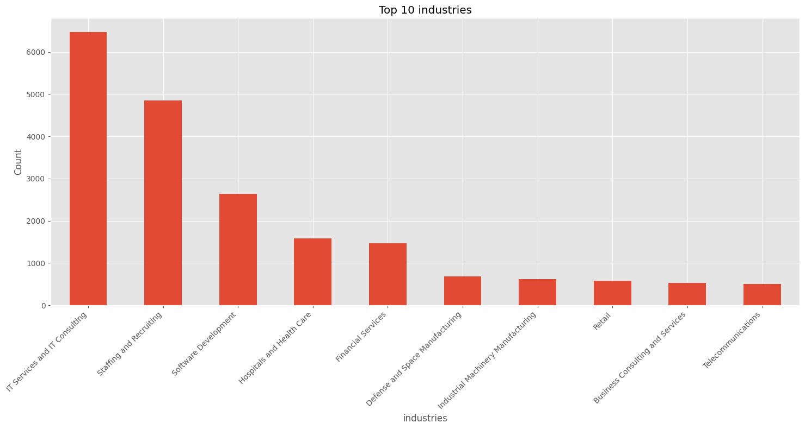

# Data Pipeline Documentation

This document describes the data pipeline for processing job posting data from Kaggle.
This pipeline fetches job posting and company data from Kaggle, performs preprocessing, and prepares the data for analysis of tech job postings.

## Data Processing Pipeline

### 1. Data Acquisition

- Fetch company and job posting data from Kaggle
- Load multiple related datasets:
  - Company industries
  - Company specialities
  - Employee counts

### 2. Data Preprocessing

- Drop unused columns to reduce dataset size
- Convert columns to appropriate data types
- Clean text fields (descriptions, titles)
- Merge related datasets to create comprehensive view
- Remove entries with null values in critical fields (job_title, job_description)

### 3. Data Analysis

- Perform exploratory data analysis (EDA) on:
  - Company information
  - Industry distribution
  - Job posting characteristics
- Create visualizations of top industries and job titles

### 4. Tech Job Filtering

- Filter job postings to focus on tech-related positions
- Create a specialized dataset for tech industry analysis
- Save processed data to Parquet format for efficient storage and retrieval

## Data Bias Detection Using Data Slicing

Since the dataset from Kaggle is not representative of the entire job market, we need to be aware of potential biases in the data. Below are some interesting slices of the data that can help us understand the biases:

The dataset is skewed towards software engineering roles, with the top job titles being related to software development.

The dataset contains job postings from a variety of companies, with the top companies being well-known tech giants, however usual suspects like Apple, Meta/Facebook are missing. The distribution of companies is definitely not representative of the entire job market.

The industries are definitely dominated by tech companies, with the top industries being related to technology and software development.
